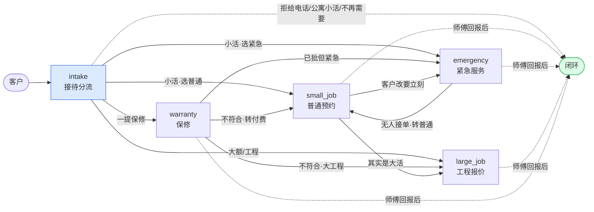

# Fangxin Plumbing — 五 Agent 流程图

对应当前 `agents/*.md` 的实际实现。方框里的 `code` 是真实工具名和工单状态。

## 总览：谁把活交给谁



## intake — 接待分流

```mermaid
flowchart TD
    A([客户接入]) --> B[问候<br/>`ticket.create`]
    B --> C[索取电话并说明用途<br/>客户先问价：告知稍后答]
    C --> D{给号码？}

    D -->|否| E["`General Consultation`<br/>只答服务范围/大致价格/营业时间<br/>明确：不能预约·派单·正式报价"]
    E --> Z([闭环：thanks_closing → Closed])

    D -->|是| F["`crm.lookup_by_phone`<br/>→ `Phone Verified` → `Customer Identified`"]
    F --> G{老客户？}
    G -->|是| H[用档案姓名<br/>主动提未完成预约]
    G -->|否| I2[收姓名/地址/问题<br/>`crm.create_customer`]
    H --> J
    I2 --> J{客户提到保修？}

    J -->|是| K["记录 `ticket.set_fields`<br/>→ `Warranty Eligibility Review`<br/>**不查资格·不预判结果**"]
    K --> W([→ warranty])

    J -->|否| M["`Needs Assessment`<br/>问：故障·风险·地址·**物业类型**·能否展示·要不要立刻"]
    M --> N{有安全风险？}
    N -->|是| O["`rules.get_safety_advisory`<br/>先给安全提示"]
    O --> P{燃气/火/触电/人身危险？}
    P -->|是| Q[让客户立即打 911<br/>声明我们不做此类判断]
    Q --> R
    P -->|否| R
    N -->|否| R[["`rules.get_job_sizing`<br/>判规模"]]

    R --> S{规模}
    S -->|大额·工程·无法判断者除外| T([→ large_job<br/>跳过服务选择])
    S -->|其余一切<br/>含追问一轮仍判断不了| U{"`rules.check_service_eligibility`<br/>物业类型 = 公寓？"}

    U -->|是| V["说明保险不 cover strata<br/>不含糊·无例外·不引导改口径<br/>指个做 strata 的同行"]
    V --> Z

    U -->|否| AA["`clock.now`<br/>`calendar.find_slots`<br/>`rules.get_standard_service_fee`<br/>`rules.get_emergency_fee`"]
    AA --> AB["一条消息给出两个选项：<br/>普通=最早真实时段+检查费<br/>紧急=尽快+当前时段费率+100 可退定金<br/>接受报价可抵扣"]
    AB --> AC{客户选？}
    AC -->|普通| AD([→ small_job])
    AC -->|紧急| AE([→ emergency])
    AC -->|不肯决定| AD

    note[/"地址带 3 位以上单元号<br/>Unit 305 · #1204 · 1502-800 Broadway<br/>→ 先问是不是公寓"/]
    note -.-> M

    classDef warn fill:#fef3c7,stroke:#d97706
    classDef stop fill:#fee2e2,stroke:#dc2626
    class V,Q stop
    class note warn
```

## small_job — 普通预约

```mermaid
flowchart TD
    A([intake 交接]) --> B{"物业=公寓？<br/>(自己再查一遍)"}
    B -->|是| C[说明不做+指同行] --> Z([thanks_closing → Closed])
    B -->|否| D["`ticket.get`<br/>已有信息一概不重问"]

    D --> E["`clock.now` + `calendar.find_slots`"]
    E --> F["**讲全四段收费**：<br/>①上门费 CAD 100<br/>②师傅到场看过·告知问题·给维修报价<br/>③接受→检查费从维修费抵掉<br/>④不接受→检查费照收"]
    F --> G[客户选时段]
    G --> H["`calendar.create_appointment` kind=standard<br/>→ `Appointment Booked`"]
    H --> I["**两条确认短信**<br/>客户：时间·地址·师傅·收费四段简版<br/>师傅：地址·客户联系方式·故障"]
    I --> J([→ 公用交接规则])

    D --> K{客户后来要改？}
    K -->|改期| L["`calendar.reschedule` → `Appointment Rescheduled`<br/>**改期免费·主动说**"] --> I
    K -->|取消| M["`calendar.cancel` → `Appointment Cancelled`<br/>**取消免费·不追问理由**"] --> Z

    D --> N{其实是大活？}
    N -->|是| O([→ large_job])
    D --> P{客户改要立刻？}
    P -->|是| Q([→ emergency])
```

## emergency — 紧急服务

```mermaid
flowchart TD
    A([intake 交接]) --> B{物业=公寓？}
    B -->|是| C[说明不做] --> Z([thanks_closing → Closed])
    B -->|否| D["`ticket.get`<br/>确认：姓名·电话·**完整地址**·故障·人身风险"]
    D --> E{有危险？}
    E -->|是| F["`rules.get_safety_advisory`<br/>燃气/火/触电 → 先打 911"]
    F --> G
    E -->|否| G["`clock.now` + `rules.get_emergency_fee`"]

    G --> H["告知：当前时段检查费<br/>**+ 需先付 CAD 100 可退定金才开始找人**<br/>定金抵检查费·检查费抵维修费"]
    H --> I{继续？}
    I -->|否| Z

    I -->|是| J["`payment.send_deposit_link` + `sms.send`<br/>→ `Deposit Link Sent`"]
    J --> K["`payment.check_status`"]
    K -->|未付| L[提醒一次·不催·不开始搜] --> K
    K -->|已付| M["→ `Deposit Paid`<br/>**告知客户：开始找师傅了·不用在线等·留意短信**"]

    M --> N["→ `Emergency Technician Search`<br/>`phone.list_available_technicians`"]
    N --> O["`phone.call_technician` 逐个<br/>带 round_number"]
    O --> P{有人接？}

    P -->|是| Q["→ `Emergency Technician Confirmed`<br/>`calendar.create_appointment` kind=emergency<br/>→ `Emergency Job Dispatched`"]
    Q --> R["两条确认短信<br/>客户：师傅名·ETA·定金抵扣·费率<br/>师傅：地址·联系方式·故障"]
    R --> S([→ 公用交接规则])

    P -->|否| T["`clock.advance` 10 分钟<br/>**轮次之间不发消息给客户**"]
    T --> U{"到上限？<br/>6 轮 / 1 小时"}
    U -->|否| O
    U -->|是| V["短信问客户：还要继续等吗"]
    V --> W{继续？}
    W -->|不等了| X["`payment.refund_deposit` **自动退**<br/>不让客户开口要·不拿普通预约回避退款"]
    X --> Y[退款确认短信] --> Z
    W -->|继续| T

    S --> AA{取消？}
    AA -->|师傅未出发| AB["`calendar.cancel` + 通知师傅<br/>`payment.refund_deposit`"] --> Z
    AA -->|已出发/已到场| AC["**不得退款**·工具会拒绝<br/>`escalate.raise` 转主管·不预判结果"]

    classDef stop fill:#fee2e2,stroke:#dc2626
    class AC,C stop
```

## large_job — 工程报价

```mermaid
flowchart TD
    A([intake / small_job / warranty 交接]) --> B["`ticket.get`<br/>**唯一不做公寓拦截的 agent**<br/>公寓大工程有人工判断"]
    B --> C["说明报价免费<br/>收：姓名·电话·**邮箱**·地址·物业性质<br/>想做什么·期望开工·谁签字"]
    C --> D["`crm.update_customer` 把邮箱写进档案"]
    D --> E["→ `Large Project Documents Requested`<br/>`email.request_materials`<br/>**说清要拍什么**"]
    E --> F["告知：回复那封邮件·不用在线等"]
    F --> G["`email.get_materials`<br/>`clock.advance` 间隔查"]
    G --> H{收到？}

    H -->|一直不回| I["直说没看到东西没法报价<br/>门开着·不追到底"] --> Z([Closed])

    H -->|收到| J["→ `Large Project Documents Received`<br/>**告知客户：师傅审阅·约 2 个工作日给报价**"]
    J --> K["`sms.send` 通知师傅去邮箱看资料"]
    K --> L["→ `Large Project Under Review`<br/>**结束通话**"]
    L --> M([→ 公用交接规则·48 小时])

    N[/"**永不报价**<br/>不估·不给区间<br/>不重复客户说的别家价"/] -.-> B
    classDef warn fill:#fef3c7,stroke:#d97706
    class N warn
```

## warranty — 保修

```mermaid
flowchart TD
    A([intake 交接]) --> B["`ticket.get`<br/>应已在 `Warranty Eligibility Review`"]
    B --> C["`crm.get_warranty_candidates`<br/>`rules.get_warranty_policy`"]
    C --> D["跟客户确认：<br/>是不是**同一处活**·是不是**同一个地址**"]
    D --> E{客户援引过往说法？}
    E -->|是| F["`crm.get_conversation_history`<br/>记录支持→认<br/>记录不支持→引原话带日期"]
    F --> G
    E -->|否| G{记录怎么说？}

    G -->|明确不符<br/>过期·通渠·地址不符·查无此单| H["直接说明原因<br/>不含糊·不暗示例外<br/>**不惊动师傅**"]
    H --> I{按付费服务做？}
    I -->|要| J["→ `Needs Assessment`"] --> K([→ small_job / large_job])
    I -->|不要| Z([thanks_closing → Closed<br/>**同轮完成**])

    G -->|说不清| L["`review.request_warranty` 不带 job_id<br/>**→ 转当班师傅**·不升级主管"]
    G -->|记录通过| M["**先告诉客户结论**：<br/>在保修期内·这类有保修·上门不收费·正在推进"]
    M --> N["`review.request_warranty` 带 job_id<br/>→ **当初做那单的师傅**"]
    L --> O
    N --> O["→ `Warranty Technician Review`<br/>**告知客户不用在线等·多久回复·有结果会联系**"]
    O --> P([→ 公用交接规则])

    P --> Q{客户事后不服？}
    Q -->|是| R["`escalate.raise` 转主管<br/>**不跟客户辩**"]

    classDef stop fill:#fee2e2,stroke:#dc2626
    class R stop
```

## 公用规则：交给师傅之后

所有 agent 共用（`_shared/technician_handover.md`）。

```mermaid
flowchart TD
    A([活到了师傅手上]) --> B["告知客户接下来会怎样·不用在线等<br/>**然后停**·不再问『还有什么能帮您』"]
    B --> C["`schedule.create_followup`<br/>间隔按流程取 `rules.get_technician_handover_policy`<br/>small_job/emergency/warranty=24h · large_job=48h"]
    C --> D["`clock.advance` 到点<br/>`technician.get_job_outcome`"]
    D --> E{师傅回报}
    E -->|还没回| D
    E -->|**做完了**| F
    E -->|**客户不做了**| F["`sms.send` thanks_closing<br/>→ 终态 → `conversation.end`"]

    G[/"AI 不做的事：<br/>追进度·转达报价·代为议价·管这趟 visit<br/>不做回访·不挽回不做的客户"/] -.-> B
    H[/"客户中途挂断也一样：<br/>编排器给 8 轮收尾时间<br/>期间无人可对话·只有工具有效"/] -.-> D

    classDef warn fill:#fef3c7,stroke:#d97706
    class G,H warn
```

## 硬闸（工具层强制，不靠 prompt 自觉）

| 闸 | 触发 |
|---|---|
| 定金未付 → 不得建紧急派单 | `calendar.create_appointment` kind=emergency |
| 师傅已出发/已到场 → 不得自动退款 | `payment.refund_deposit` |
| 周日/BC 法定假日 → 不得建普通预约 | `calendar.create_appointment` kind=standard/warranty |
| 找师傅超过 6 轮 → 拒绝继续 | `phone.call_technician` |
| 工单状态不得跳跃 | `ticket.update_status` |
| 保修必须经过人工审核才能预约 | `Warranty Eligibility Review` ↛ `Warranty Booked` |
| 真实短信/邮件/扣款需两把开关同时打开 | `live_tools_enabled` + 单个工具 `live` |
